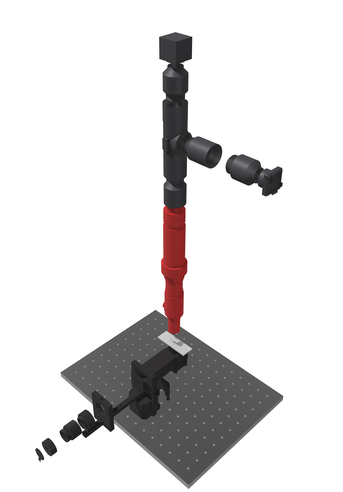
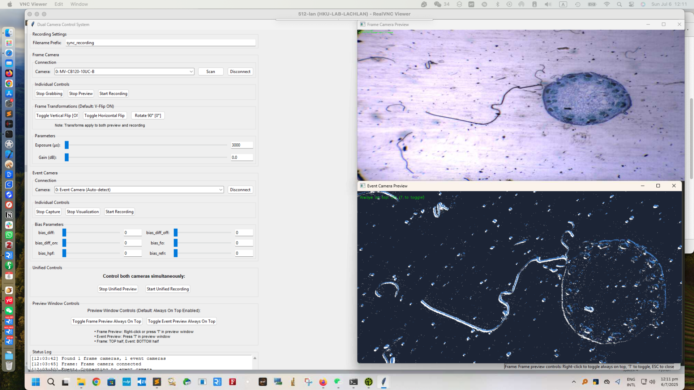

# Self-Calibrated Neuromorphic Hyperspectral Sensing
*(Rongzhou Chen, Chutian Wang, Yuxing Li, Yuqing Cao, Shuo Zhu, and Edmund Y. Lam\*)*

A comprehensive pipeline for reconstructing spectra from event cameras with dispersed light illumination (e.g., diffraction grating). The system records intensity change events $e = (x, y, t, p)$ where $p \in \{-1, +1\}$ indicates polarity of log-intensity change, and automatically infers scan timing and calibration metadata (“auto info”) directly from the event stream.

## Overview

When illumination sweeps across wavelengths over time, the event stream encodes a temporal derivative of the underlying spectrum along the dispersion axis. This pipeline provides three main stages:

1. **Segment**: Find scan timing and split recordings into forward/backward passes
2. **Compensate**: Estimate piecewise-linear time-warp to remove scan-induced temporal tilt
3. **Visualize**: Overlay learned boundaries and compare original vs. compensated time-binned frames

<p align="center">
  
  
</p>

*Left: modular transmission microscope with a motorised grating illumination arm and vertical detection stack. Right: data-acquisition GUI used to monitor segmentation, compensation, and reconstructions in real time.*

<p align="center">
  
</p>

*Full system overview combining the hardware rendering (left), reconstructed spectral slices and spectra (top right), and representative results across different samples (bottom right).*

## Quick Start

### Prerequisites

* Python 3.9+ with `numpy`, `torch`, `matplotlib`
* GPU optional but recommended for faster processing
* RAW recordings and/or segmented NPZ files

### Basic Workflow

```bash
# 1. Segment RAW into 6 scans (Forward/Backward)
python segment_robust_fixed.py \
  data/recording.raw \
  --segment_events \
  --output_dir data/segments/

# 2. Train multi-window compensation
python compensate_multiwindow_train_saved_params.py \
  data/segments/Scan_1_Forward_events.npz \
  --bin_width 50000 \
  --visualize --plot_params --a_trainable \
  --iterations 1000

# 3. Visualize results with boundaries
python visualize_boundaries_and_frames.py \
  data/segments/Scan_1_Forward_events.npz

# 4. Compare cumulative vs multi-bin means
python visualize_cumulative_compare.py \
  data/segments/Scan_1_Forward_events.npz \
  --sensor_width 1280 --sensor_height 720
```

## Core Scripts

### 1. Segmentation: `segment_robust_fixed.py`

**Goal**: Extract scan timing from raw events and slice into 6 one-way scans (F, B, F, B, F, B).

**Mathematical Description**:

* **Activity signal** (events binned with $\Delta t = 1000~\mu\text{s}$): $$a[n] = \left|\big\{ i \mid t_{\min} + n\Delta t \le t_i < t_{\min} + (n+1)\Delta t \big\}\right|.$$

* **Active window detection**: find the smallest contiguous window containing $80\%$ of events.

* **Period estimation**: autocorrelation or manual period (default: $1688$ bins).

* **Reverse-correlation** (timing structure): $R[k] = \sum_{n} a[n]\, a_{\text{rev}}[n+k]$ with $a_{\text{rev}}[n] = a[N-1-n]$.

**Usage**:

```bash
# Automatic period detection
python segment_robust_fixed.py recording.raw --segment_events --output_dir segments/

# Manual period (fixed 1688 bins)
python segment_robust_fixed.py recording.raw --segment_events --round_trip_period 1688
```

**Arguments**:

* `--segment_events`: Save individual scan segments as NPZ files
* `--round_trip_period 1688`: Use manual period (default)
* `--auto_calculate_period`: Override manual period with autocorrelation
* `--activity_fraction 0.80`: Fraction of events for active region
* `--max_iterations 2`: Refinement iterations

### 2. Compensation: `compensate_multiwindow_train_saved_params.py`

**Goal**: Learn time-warp parameters to remove scan-induced temporal shear using multi-window piecewise-linear compensation.

**Mathematical Description**:

* **Boundary surfaces**: $$T_i(x, y) = a_i x + b_i y + c_i,\quad i=0,\ldots,M-1.$$

* **Soft window memberships**: $$m_i = \sigma\!\Big(\frac{t - T_i}{\tau}\Big)\,\sigma\!\Big(\frac{T_{i+1} - t}{\tau}\Big),\qquad w_i = \frac{m_i}{\sum_j m_j + \varepsilon}.$$

* **Interpolated slopes (optional)**: $$\alpha_i = \frac{t - T_i}{T_{i+1} - T_i},\qquad \tilde{a}_i = (1-\alpha_i)a_i + \alpha_i a_{i+1},\qquad \tilde{b}_i = (1-\alpha_i)b_i + \alpha_i b_{i+1}.$$

* **Time warp**: $$\Delta t(x,y,t) = \sum_i w_i (\tilde{a}_i x + \tilde{b}_i y),\qquad t' = t - \Delta t(x,y,t).$$

* **Loss**: variance minimization of time-binned frames with smoothness regularization on parameters.

**Usage**:

```bash
# Train with a-parameters trainable, b fixed
python compensate_multiwindow_train_saved_params.py segment.npz \
  --bin_width 50000 --a_trainable --b_default -76.0 \
  --iterations 1000 --smoothness_weight 0.001

# Load pre-trained parameters
python compensate_multiwindow_train_saved_params.py segment.npz \
  --load_params learned_params.npz
```

**Key Arguments**:

* `--a_trainable` / `--a_fixed`: Control a-parameter training (default: fixed)
* `--b_trainable` / `--b_fixed`: Control b-parameter training (default: trainable)
* `--num_params 13`: Number of boundary parameters
* `--temperature 5000`: Sigmoid temperature for soft windows
* `--smoothness_weight 0.001`: Regularization weight
* `--load_params file.npz`: Load saved parameters
* `--chunk_size 250000`: Memory-efficient processing chunk size

### 3. Visualization: `visualize_boundaries_and_frames.py`

**Goal**: Display learned parameters and show qualitative improvements.

**Features**:

* Parameter overlays on $x\text{–}t$ and $y\text{–}t$ projections
* Time-binned frame comparisons (original vs. compensated)
* Sliding window analysis (50 ms and 2 ms bins)
* Wavelength mapping for spectral visualization

**Usage**:

```bash
python visualize_boundaries_and_frames.py segment.npz \
  --sample_rate 0.1 --wavelength_min 380 --wavelength_max 680
```

### 4. Cumulative Comparison: `visualize_cumulative_compare.py`

**Goal**: Compare cumulative 2 ms-step means with sliding bin means.

**Mathematical Description**:

* **Cumulative means**: $$F(T) = \frac{1}{HW}\sum_{t < T}\text{events}(t).$$

* **Sliding means**: event counts in $[T-\Delta,\,T)$ divided by $H \times W$.

* **Relationship** (finite-difference derivative): $$\Delta F(T) \approx \frac{F(T) - F(T-\Delta)}{\Delta}.$$

**Usage**:

```bash
python visualize_cumulative_compare.py segment.npz \
  --sensor_width 1280 --sensor_height 720 \
  --sample_label "My Dataset"
```

## Additional Tools

### GUI Application: `scan_compensation_gui_cloud.py`

Complete GUI for scan compensation with 3D spectral visualization.

**Features**:

* Interactive parameter tuning
* Real-time optimization progress
* 3D wavelength-mapped visualization
* Export results and parameters

**Usage**:

```bash
python scan_compensation_gui_cloud.py
```

### Dual Camera System: `sync_image_system/DualCamera_separate_transform.py`

Synchronized recording system for event and frame cameras.

## Turbo Multi‑Scan Compensation

When you have multiple one‑way scans (Forward/Backward) of the same sweep, you can merge them and run the proven trainer on a single combined event stream using `compensate_multiwindow_turbo.py`.

What it does

- Accepts one segment, an explicit list, or a whole segments directory.
- For Backward scans, flips polarity and reverses time before merging:
  - If polarity p ∈ {0,1}: p := 1 − p; then reverse time within the scan.
  - If polarity p ∈ {−1,1}: p := −p; then reverse time within the scan.
- Concatenates scans on a continuous timeline (with a 1 μs gap between scans) and calls `compensate_multiwindow_train_saved_params.py` under the hood.

Usage

```bash
# Merge all scans (Forward+Backward) from a segments folder and train at 5 ms
python compensate_multiwindow_turbo.py \
  --segments-dir path/to/…/_segments \
  --include all --sort name \
  --bin-width 5000 \
  -- --a_trainable --iterations 1000 --smoothness_weight 0.001 --chunk_size 250000 --visualize --plot_params

# Reuse learned params and just render at 10 ms (fast, no training)
python compensate_multiwindow_turbo.py \
  --segments-dir path/to/…/_segments \
  --include all --sort time \
  --bin-width 10000 \
  --load-params path/to/learned_params.npz \
  -- --visualize --plot_params

# Only Forward scans
python compensate_multiwindow_turbo.py \
  --segments-dir path/to/…/_segments \
  --include forward --sort time \
  --bin-width 5000 \
  -- --a_trainable --iterations 1000 --smoothness_weight 0.001 --chunk_size 250000
```

Options

- `--segment`, `--segments`, `--segments-dir`: choose your input set.
- `--include {all|forward|backward}`: filter by scan direction.
- `--sort {name|time}`: natural filename order or NPZ `start_time` order.
- `--bin-width <μs>`: forwarded to the base trainer.
- `--load-params`: reuse saved parameters (skip training and regenerate outputs quickly at new bin widths).
- `--extra …` after `--`: any additional flags are forwarded to the base trainer.

Speed scaling tip

If your scan is N× faster than baseline, reduce `--bin-width` by the same factor (e.g., baseline 50 ms → 10× faster → 5 ms: `--bin-width 5000`). You can train once (e.g., 5 ms), then use `--load-params` to quickly regenerate results at 10 ms without retraining.

**Features**:

* Simultaneous event and frame recording
* Real-time preview with transformations
* Always-on-top window controls
* Parameter adjustment during recording

### Arduino Motor Control: `rotor/step42_with_key_int/step42_with_key_int.ino`

Stepper motor control for scanning mechanisms.

**Features**:

* Precise angle control with microstepping
* Acceleration/deceleration profiles
* Limit switch integration
* Auto-centering functionality

## Parameter Management

The system supports comprehensive parameter save/load functionality:

### Save Formats

* **NPZ**: Binary format for fast loading
* **JSON**: Human-readable with metadata
* **CSV**: Excel-compatible for manual inspection

### Parameter Loading

```bash
# Load any supported format
python compensate_multiwindow_train_saved_params.py segment.npz \
  --load_params learned_params.npz
  # or --load_params learned_params.json
  # or --load_params learned_params.csv
```

### Parameter Files

Files are automatically named with parameter count: `*_learned_params_n13.*`

## Memory Optimization

The system uses chunked processing throughout:

* **Chunk Size**: Default $250{,}000$ events (configurable)
* **Memory Efficient**: Processes large datasets without GPU overflow
* **Unified Variance**: Maintains proper gradient flow for learning
* **Progress Tracking**: Real-time processing updates

## Output Structure

```
project/
├── data/
│   ├── recording.raw                    # Original RAW file
│   ├── recording_segments/              # Segmented scans
│   │   ├── Scan_1_Forward_events.npz   
│   │   ├── Scan_2_Backward_events.npz  
│   │   └── ...
│   ├── learned_params_n13.npz          # Trained parameters
│   ├── learned_params_n13.json         
│   ├── learned_params_n13.csv          
│   └── visualization_20240115_143022/  # Results
│       ├── events_with_params.png      
│       ├── sliding_frames_*.npz        
│       ├── frame_means_wavelength.png  
│       └── time_binned_frames/         # Individual frames
```

## Configuration Examples

### High-Precision Compensation

```bash
python compensate_multiwindow_train_saved_params.py segment.npz \
  --num_params 21 --temperature 3000 --iterations 2000 \
  --a_trainable --b_trainable --boundary_trainable \
  --smoothness_weight 0.0001 --chunk_size 100000
```

### Fast Processing

```bash
python compensate_multiwindow_train_saved_params.py segment.npz \
  --num_params 7 --iterations 500 --chunk_size 500000 \
  --a_fixed --b_default -76.0
```

### Memory Constrained

```bash
python compensate_multiwindow_train_saved_params.py segment.npz \
  --chunk_size 50000 --bin_width 100000
```

## Wavelength Mapping

The system supports spectral visualization by mapping temporal evolution to wavelength:

```python
# Linear mapping: time → wavelength
wavelength = wavelength_min + (t_normalized / t_max) * (wavelength_max - wavelength_min)
```

**Default Range**: $380\text{–}680~\text{nm}$ (configurable)

## Tips and Best Practices

### Parameter Selection

* **Microstepping**: Use $32\times$ for smooth motion (Arduino)
* **Bin Width**: Start with $50\,\text{ms}$ for optimization, $2\,\text{ms}$ for analysis
* **Temperature**: Higher values ($\sim 5000$) for smoother boundaries
* **Smoothness**: $0.001$ provides good regularization

### Memory Management

* **GPU Memory**: Use chunked processing with appropriate chunk size
* **Event Count**: $> 10^6$ events recommended for stable learning
* **Iterations**: $1000$ iterations usually sufficient

### File Organization

* Keep RAW files and segments in same directory
* Parameter files auto-detected by naming convention
* Use descriptive filename prefixes for organized output

### Troubleshooting

* **Parameter Loading**: Ensure matching parameter count in filename
* **Memory Issues**: Reduce `--chunk_size` and `--bin_width`
* **Poor Compensation**: Increase iterations or enable more trainable parameters

## Citation

If this repository is useful in your research, please cite the associated manuscript (under review):

```bibtex
@article{chen2025selfcalibrated,
  title   = {Self-Calibrated Neuromorphic Hyperspectral Sensing},
  author  = {Chen, Rongzhou and Wang, Chutian and Li, Yuxing and Cao, Yuqing and Zhu, Shuo and Lam, Edmund Y.},
  year    = {2025},
  note    = {Manuscript under review}
}
```

## License

\[License information]

## Contributing

Contributions welcome! Please read our contributing guidelines and submit pull requests for any improvements.
